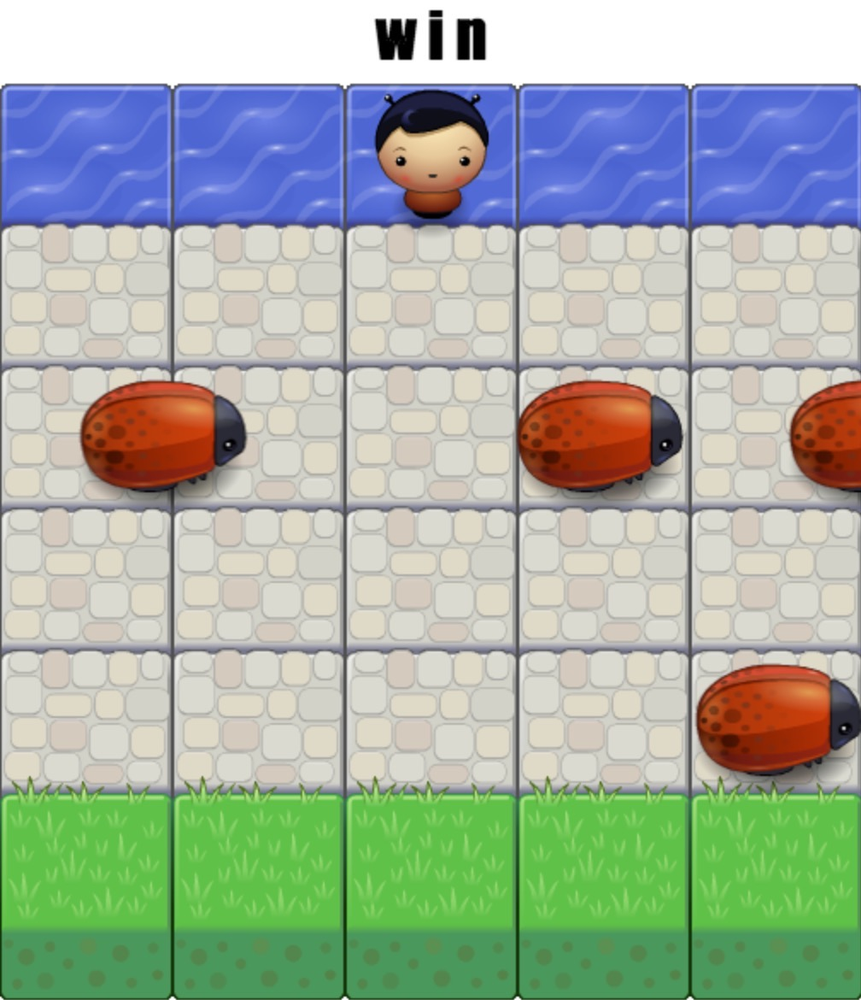

Arcade_Game
===============================
1. ### 游戏介绍
街机游戏克隆，控制玩家避开敌人获得胜利
- 运行 `index.html`
- 控制玩家到达河岸即可获胜
- 与敌人碰撞游戏会重新开始

2. ### 已实现功能模块
- [x] 玩家无法移动至屏幕外 
- [x] 敌人横穿屏幕 
- [x] 敌人玩家相撞，游戏重新开始 
- [x] 玩家获胜后出现相应的动画 

3. ### 游戏玩法
通过键盘 `↑ ↓ ← →` 来进行移动玩家，躲避敌人到达河对岸获得胜利并出现代表游戏胜利的动画

